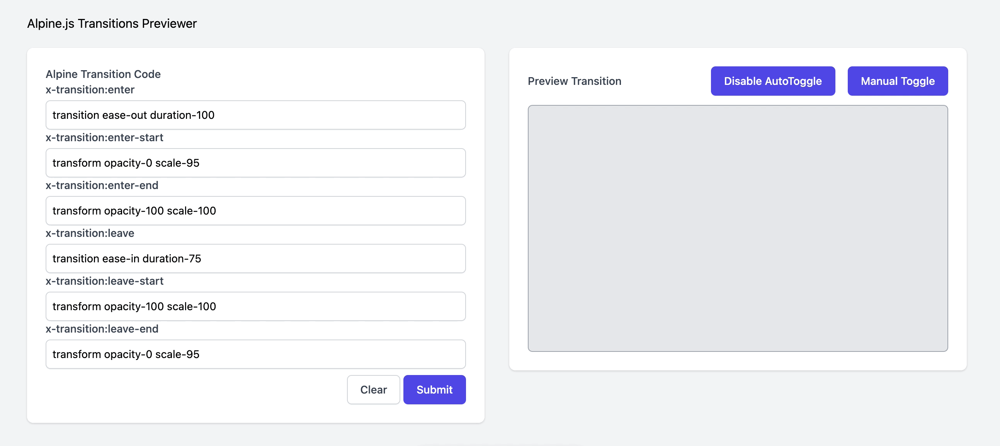

# Alpine Transitions Previewer

[Github Pages Deployment](https://hallindavid.github.io/alpine-transition-preview/)

If you use Alpine.js and Tailwindcss, this can fit in really nicely to your design process, but if you also have
a <a href="https://tailwindui.com" target="_blank">TailwindUI</a> license, there is a bit more value.

alpine-transitions-preview is an open-source (MIT) one-page alpine.js/tailwindcss application which is designed to
perform primarily two functions. it is not affiliated or supported by alpine.js or tailwindcss

1. It allows you to preview your alpinejs transitions so you can preview & tweak them easily before moving them to your
   application. (see below)

 

2. It allows you to copy/paste blocks of transition code (like for modals/dropdowns/other js components in TailwindUI)
   into the page, and it will output the proper alpine.js transitions markup (see below)

 

[Github Pages Deployment](https://hallindavid.github.io/alpine-transition-preview/)

## Issues

Please report all issues in the GitHub Issue tracker

## Contributing

Shoot me an email, or DM me on Twitter and I am happy to allow other contributors.
